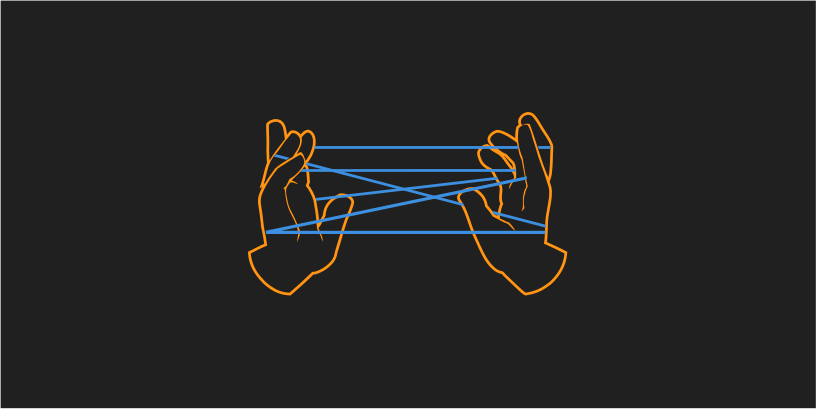

# handshake

### a peculiar chat app for strange times

Handshake is designed to be an experiment in one-time key symmetric encrypted communications. The tool is based on in-person initialization of communication so that all future transmissions rely on symmetric key cryptography. This is primarily a design for out-of-band communication in which communicating parties aim to mitigate potential compromises in asymmetric encryption methodology ranging from CA poisoning, reliance on trusted centralized service providers for communications technology, and even explore patterns in post quantum readiness.

Handshake is designed initially to work on [IPFS](https://ipfs.io) and [hashmap](https://hashmap.sh), but there are no technical reasons other backends couldn't be supported. In fact, support for **_strategies_** are built into the the core of handshake to allow for experimentation. For the sake of focus, this initial implementation utilizes hashmap and IPFS, but tooling other decentralized tooling based around smart contracts, and other systems should be able to be incorporated in the future.

You can read more about how handshake works in the [design doc](design-docs/handshake-core.md).

You can check out an early cli based proof-of-concept here:

